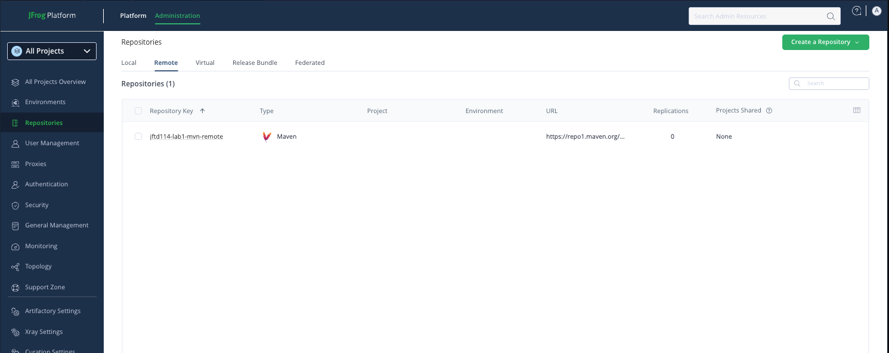
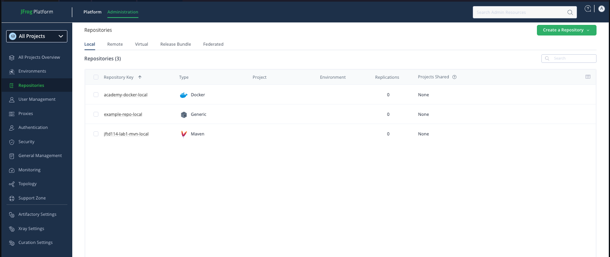
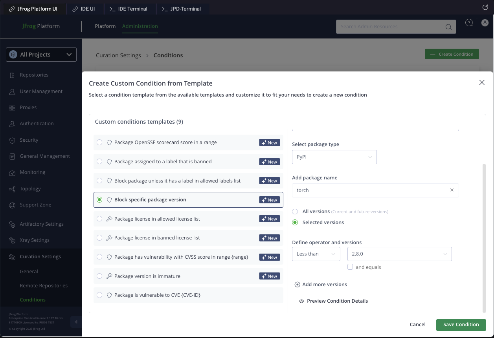
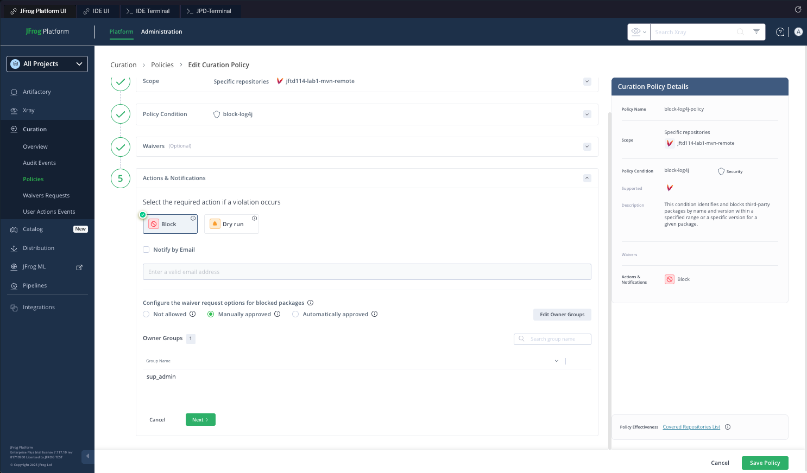
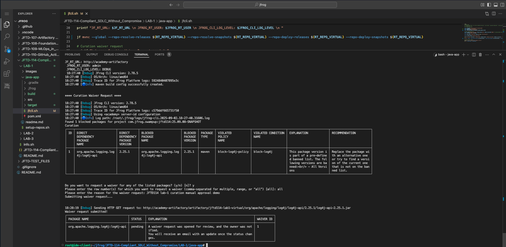
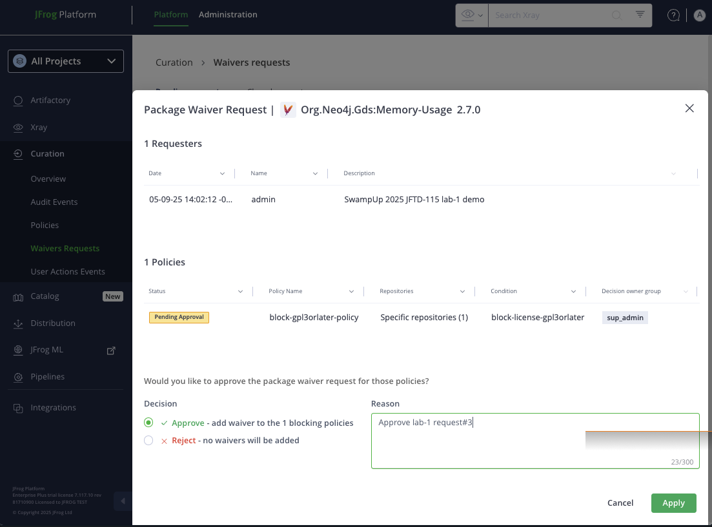
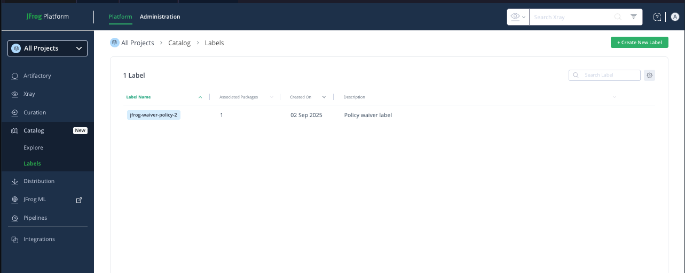
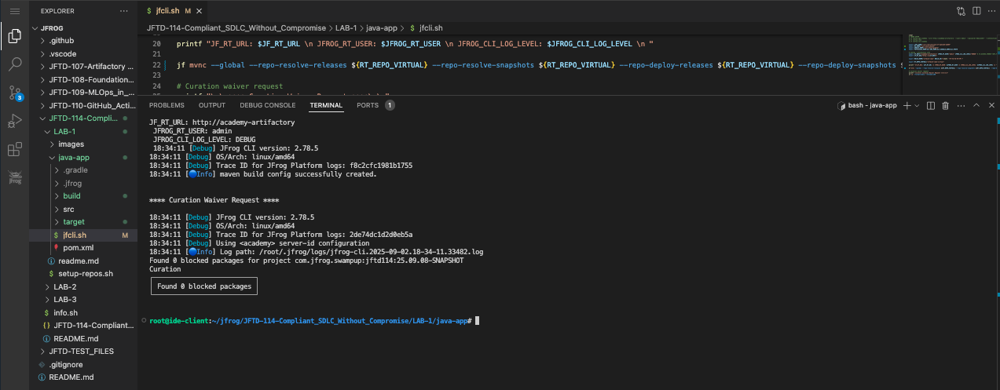

# Lab 1: OSS Filtering using Curated Remote Repo
Welcome to the SwampUp 2025 hands-on lab for JFrog Curation! This lab will guide you through the process of setting up and using Curation to control the open-source software (OSS) that enters your organization's software supply chain.

JFrog Curation is a powerful tool that allows you to establish automated policies to approve or block OSS packages from public repositories based on security vulnerabilities, license compliance, and other custom conditions. This lab will walk you through a common use case: blocking a vulnerable version of a package (log4j) and then managing a developer's request for an exception.

## Prerequisites
- Before you start, make sure you have the following ready:
- JFrog CLI: Installed and configured in your shell's PATH.
- JFrog Platform Access: You'll need the URL and login credentials for your JFrog instance.
- Lab Files: You should have the lab scripts checked out locally.
- JFrog Platform UI credentials
    - username: ``` admin ```
    - Password: ``` Admin1234! ```

## Setup and Configuration
First, let's set up the necessary repositories using a script.

### Navigate to the Lab Directory
Open your terminal or IDE's built-in terminal and change to the lab directory.
```
cd ~/jfrog/JFTD-114-Compliant_SDLC_Without_Compromise/LAB-1
```

### Create Repositories
Run the setup script to automatically create Gradle repositories in Artifactory. 
````
    ./setup-repos.sh
````
This script will create the remote, local, and virtual repositories needed for the lab.
 <br/>
 <br/>
 <br/>
 <br/>


## Curation

### Enabling
Now, let's enable Curation in the JFrog Platform UI.
- Navigate to the Administration module, then go to Curation -> General.
- Toggle the switch to turn Curation On.

<br/>

- Click on Enable repositories.

<br/>

- Select the maven package type to enable Curation for all remote repositories of that type.

<br/>


### Creating a Curation Condition
Conditions are the building blocks of Curation policies. Let's create a condition to specifically block vulnerable versions of log4j.

- Navigate to **Administration** >> **Curation Settings** and select the Conditions tab.
- Click **Create Condition.**

<br/> 

- Fill in the details to block org.apache.logging.log4j:log4j-api. We will block all versions for this example.

<br/>


### Creating a Curation Policy
Policies apply conditions to specific repositories.

- Navigate to Curation -> Policies and create a new policy.
- Configure the policy to use the block-log4j condition on your remote repository. Set the action to Block and allow for Manually approved waivers.

     <br/>

## Developer: Auditing a Requesting a Waiver
The developer uses the `jf ca` command to check if their app dependencies violate any Curation policies before attempting to download them.

```
cd java-app
```

The output will show that the package is blocked by the 'blocked-log4j-policy' policy. Because the policy is configured to allow manual waivers, the developer is prompted to request one.

- Request the Waiver: The developer follows the interactive prompts in the CLI to select the package and provide a justification for the waiver.

<br/>


## Approver: Reviewing and Approving the Waiver
The designated approver (a member of the sup-admin group) manages the request in the JFrog Platform.

- The approver receives a notification and navigates to the waiver management interface to see the pending request.

<br/>

- They can review the package details, the developer's justification, and the policies that are blocking it.
- Upon approval, the label is automatically applied to the package in the Catalog, making it available for download.
 
<br/>

After approval, the developer can successfully resolve and download the dependency into their project. 🎉

<br/>

## References
- JFrog CLI: https://docs.jfrog-applications.jfrog.io/jfrog-applications/jfrog-cli/binaries-management-with-jfrog-artifactory/package-managers-integration
- Curation supported technologies: https://jfrog.com/help/r/jfrog-security-user-guide/products/curation/supported-technologies