# Lab 1: OSS Filtering using Curated Remote Repo
This lab walks you through configuring and using JFrog Curation to block unwanted open-source software (OSS) packages from entering your software supply chain. You'll set up a policy to block all packages by default and then create a manual waiver process for developers to request exceptions.

## Prerequisites
- Before you start, make sure you have the following ready:
- JFrog CLI: Installed and configured in your shell's PATH.
- JFrog Platform Access: You'll need the URL and login credentials for your JFrog instance.
- `jq` The command-line JSON processor must be installed.
- Lab Files: You should have the lab scripts checked out locally.
- JFrog Platform UI credentials
    - username: ``` admin ```
    - Password: ``` Admin1234! ```
## Setup and Configuration
First, let's set up the necessary repositories using a script.

### Navigate to the Lab Directory
Open your terminal or IDE's built-in terminal and change to the lab directory.
```
cd ~/jfrog/JFTD-114-Compliant_SDLC_Without_Compromise/LAB-1
```

### Create Repositories
Run the setup script to automatically create three remote repositories (for Maven, PyPI, and NPM) in Artifactory. The script adds a timestamp to the repository names to ensure they are unique.
````
    ./setup-repos.sh
````
This script will create the remote, local, and virtual repositories needed for the lab.
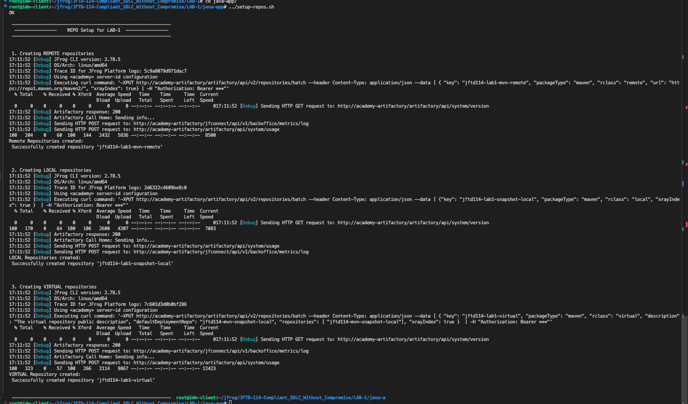 <br/>
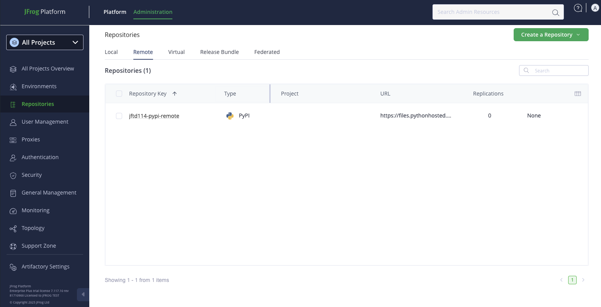 <br/>

## Curation Policy Setup
Now, let's configure the curation policy in the JFrog Platform UI.

### Enable Curation
- Next, you need to enable the Curation service for the repositories.
- Navigate to **Administration** >> **Curation Settings**.
- Toggle the switch to **Enable Curation**.

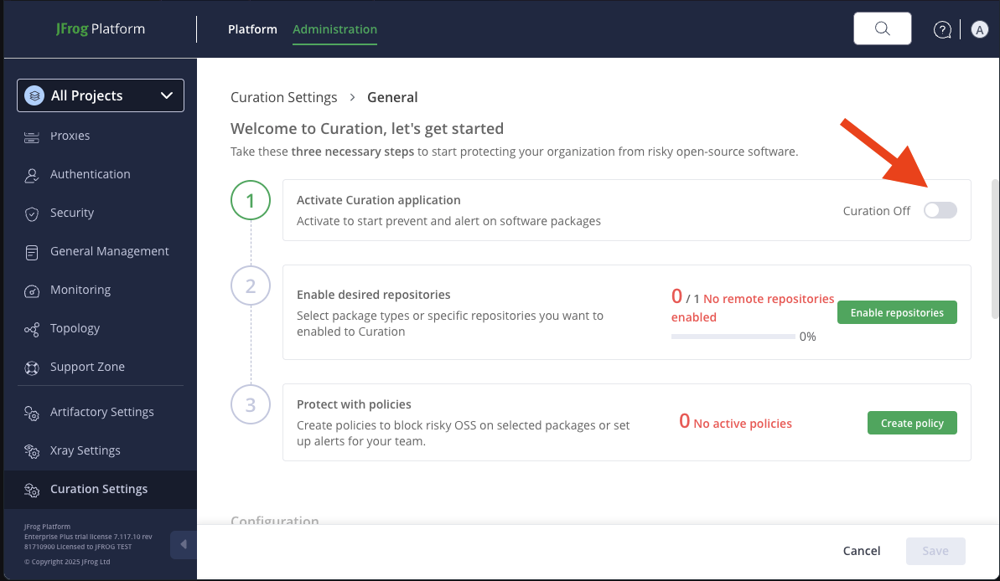<br/>

- Next, click on to enable Enable repositories

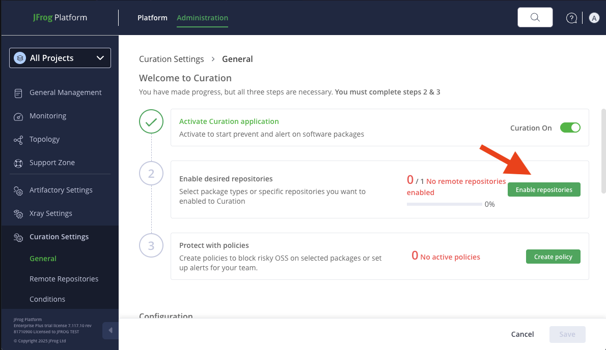<br/>

- From the list of repositories, toggle the remote repositories you created with the `setup-repos.sh` script to enable curation on them.

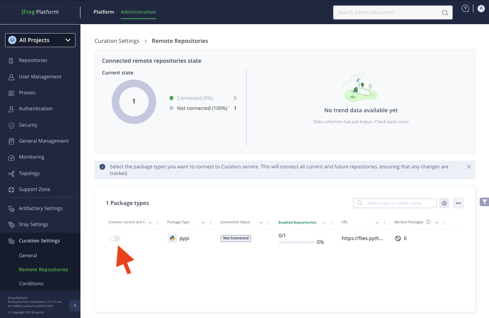<br/>


### Create a Labels
Labels are used to tag packages, and we'll use one to identify packages that are approved for use.

- Navigate to **Platform** >> **Catalog** >> **Labels**.
- Click the **Create New Label** button.

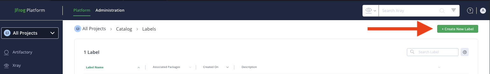 <br/>

- Enter the following details:
    - Label Name: ` ALLOW-THIS `
    - Description: ` ALLOW PACKAGES  `

- Enter the following details:
    - Label Name: ` SADMIN-ALLOW `
    - Description: ` Allowed by Security Admin for Demo purpose only  `

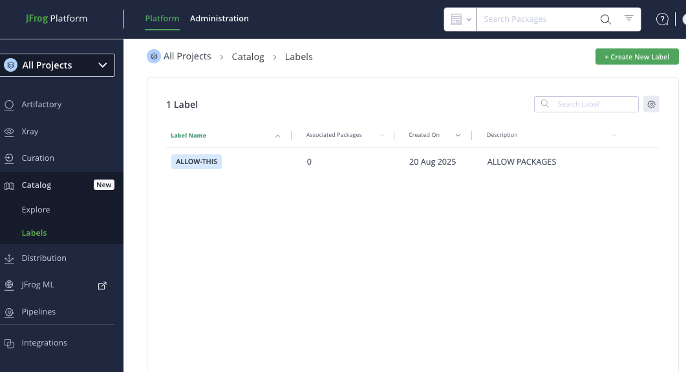 <br/>

- Click **Save Label**.


### Create a Curation Condition
The condition defines the logic for our policy. Here, we'll create a condition to block everything unless it's explicitly allowed.

- Navigate to **Administration** >> **Curation Settings** and select the Conditions tab.
- Click **Create Condition.**
- Select the Custom conditions templates tab and choose `Block package unless it has a label in allowed labels list`.
- Fill in the fields:
    - Condition Name: ` DEFAULT-BLOCK-ALL `
    - Allowed Label: ` ALLOW-THIS ` (Select from the dropdown)
- Click **Save Condition**.

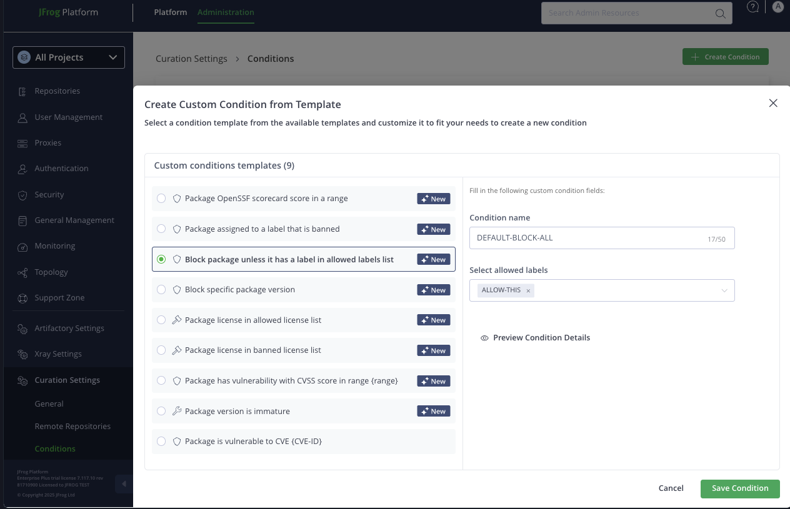<br/>


### Create a Curation Policy
Finally, assemble the components into a policy that applies to a specific repository.

- Navigate to **Administration** >> **Curation Settings** and select the General tab.
- Click **Create policy** and enter the following details:
    - Policy Name: `curation-blocked-remote`
    - Scope: Select **Specific remote repositories** and choose the `pypi-remote` repository created by the script.

    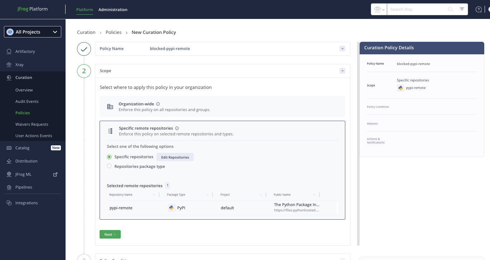 <br/>

    - Policy Condition: Select `DEFAULT-BLOCK-ALL` from the dropdown.

    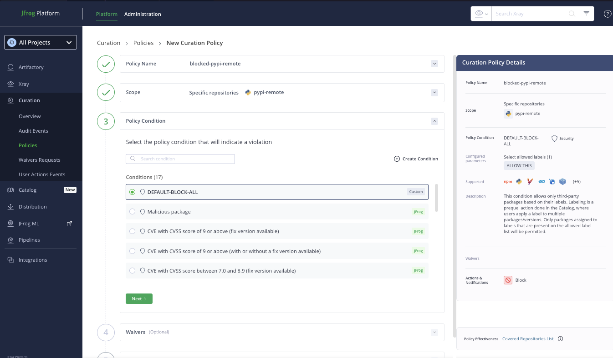 <br/>

    - Waiver label: `SADMIN-ALLOW`
    - Justification: `Allow for Swampup Lab`

    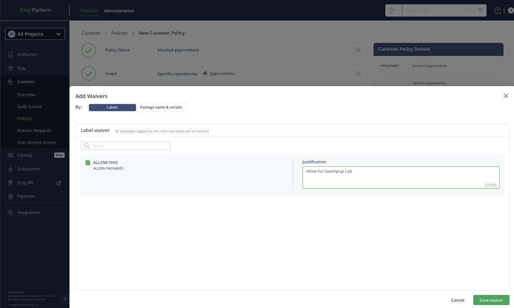 <br/>

    - Actions & Notification:
        - Action: `Choose Block`.
        - Waiver Request: `Set to Manual approved`.
        - Owner Groups: `sup-admin (or another appropriate admin group)`.
        - **Save** the policy.


## Developer: Auditing a Requesting a Waiver
The developer uses the `jf ca` command to check if their app dependencies violate any Curation policies before attempting to download them.

```
cd py-app
```

- Configure the project's repository: In the project directory, configure the JFrog CLI to use the virtual repository you created. For a PyPI project, this would be:

```
jf pipc --repo-resolve='pypi-remote'
```

- Run the Curation Audit: Execute the curation-audit command to scan the project.

```
jf ca --requirements-file=requirements.txt --format=table --threads=100
```

The output will show that the package is blocked by the 'blocked-pypi-remote' policy. Because the policy is configured to allow manual waivers, the developer is prompted to request one.

- Request the Waiver: The developer follows the interactive prompts in the CLI to select the package and provide a justification for the waiver.


<br/>


## Approver: Reviewing and Approving the Waiver
The designated approver (a member of the sup-admin group) manages the request in the JFrog Platform.

- The approver receives a notification and navigates to the waiver management interface to see the pending request.
- They can review the package details, the developer's justification, and the policies that are blocking it.
- Upon approval, the ALLOW-THIS label is automatically applied to the package in the Catalog, making it available for download.

After approval, the developer can successfully resolve and download the dependency into their project. 🎉


## References
- JFrog CLI: https://docs.jfrog-applications.jfrog.io/jfrog-applications/jfrog-cli/binaries-management-with-jfrog-artifactory/package-managers-integration#building-python-packages
- Curation supported technologies: https://jfrog.com/help/r/jfrog-security-user-guide/products/curation/supported-technologies