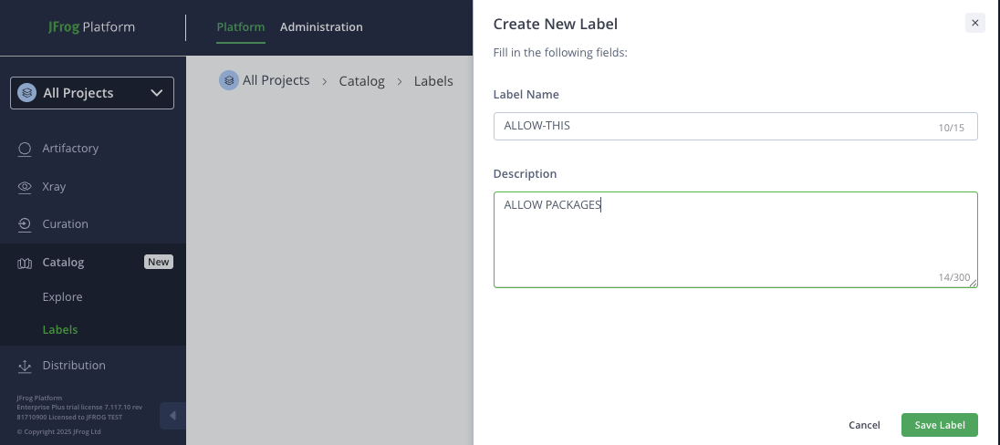
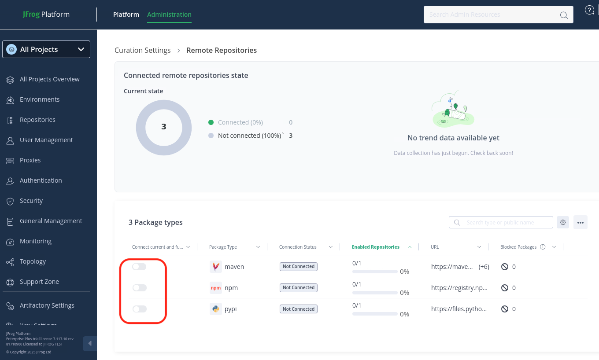

# Lab 1: OSS Filtering using Curated Remote Repo
The script automates the configuration of a JFrog Artifactory instance by setting up remote repositories and a curation policy using the JFrog CLI and REST API

## Prerequisites
- JFrog CLI installed and available in your shell environment.
- Access to your JFrog Artifactory instance with credentials.
- `jq` tool for JSON processing.

## Steps
### Setup
- Configure JFrog CLI for Artifactory and Xray (non-interactive)
- Verify setup configuration and Artifactory availability.
- Artifactory: Creates 3 remote repositories (Maven, PyPI, NPM) with names containing a timestamp.


## Artifactory 
- change direcotry in IDE UI or IDE Terminal
```
cd ~/jfrog/JFTD-114-Compliant_SDLC_Without_Compromise/LAB-1
```

### Create repositories using CLI
- Run the command in the *LAB-1* folder
    - Remote
    - Local
    - Virtual
````
    ./setup-repos.sh
````


## Curation

### Platform >> Catalog >> Labels
- Create label by clicking button `Create New Label`

<br/>
- Enter *Label Name* and *Description*
    - ` ALLOW-THIS `
    - ` ALLOW PACKAGES `

<br/>
- Click button `Save Label`


### Administration >> Curation Settings
- Toggle to enable Curation

<br/>
- Enable desired repositories

<br/>
- Toggle the remote repositories created using 'setup-repos.sh'

<br/>
- Navigate to Administration >> Curation Settings >> Conditions
- Click buttion `Create Condition` 
- Select 'Custom conditions templates' is `Block package unless it has a label in allowed labels list` and enter below values
        - ` DEFAULT-BLOCK-ALL `
        - ` ALLOW-THIS `

<br/>
- Navigate to Administration >> Curation Settings >> General
- Click buttion `Create policy` and enter below values
    - Policy Name is ` blocked-pypi-remote `
    - Scope select 'Specific remote repositories' is ` pypi-remote ` 
     <br/>
    - Select 'Policy Condition' as ` DEFAULT-BLOCK-ALL `
     <br/>
    - Select 'Waiver label' as ` ALLOW-THIS ` and 'Justification' as ` Allow for Swampup Lab `
     <br/>
    - Actions & Notifcation 
        - Select the required action if a violation occurs as ` Block `
        - Configure the waiver request options for blocked packages as ` Manual approved `
        - Owner Groups as ` sup-admin `


### Developer waiver request

<br/>

### Approver screens

<br/>

<br/>

## References
