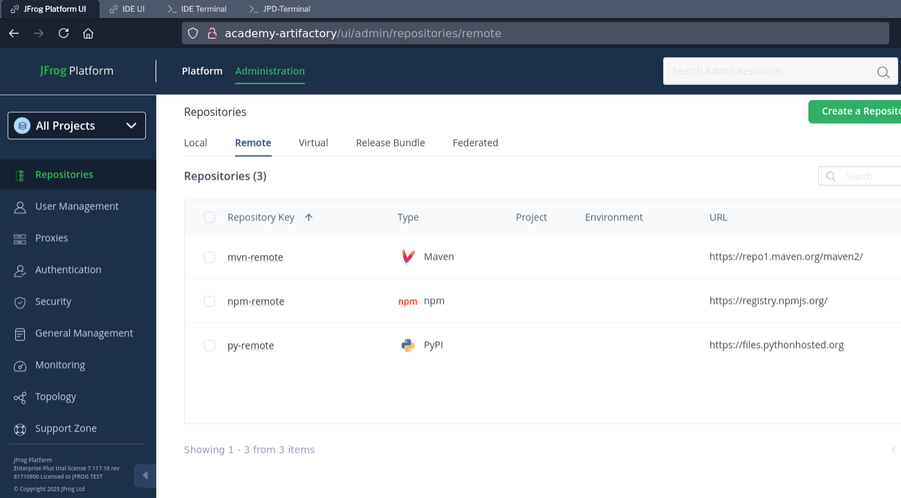
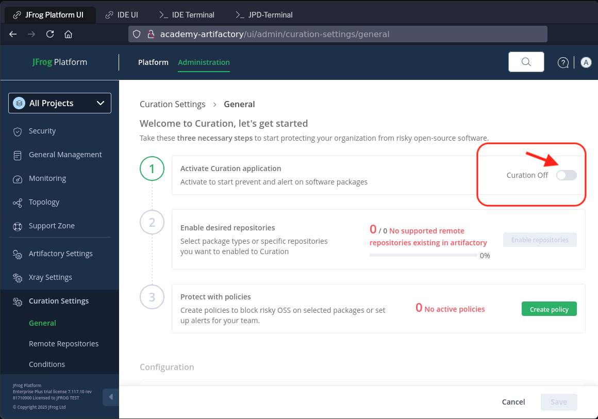
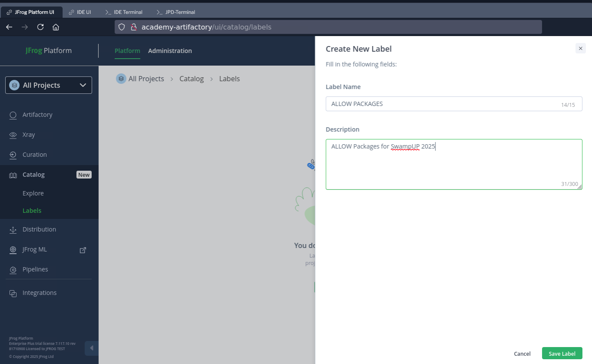
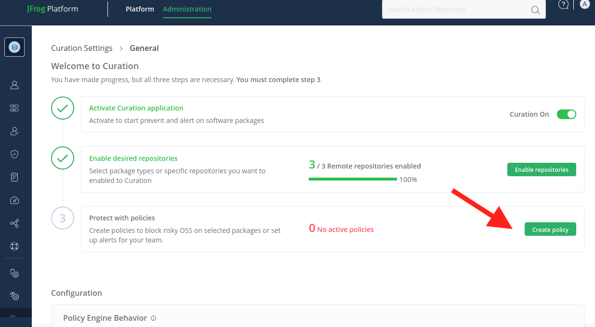
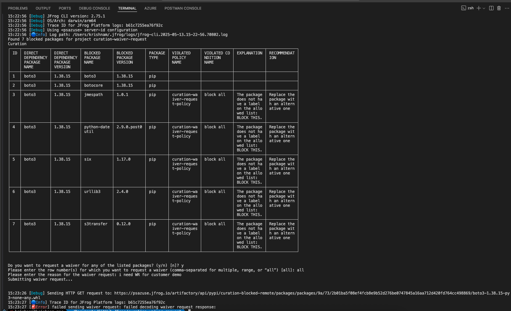

# Lab 1: OSS Filtering using Curated Remote Repo
The script automates the configuration of a JFrog Artifactory instance by setting up remote repositories and a curation policy using the JFrog CLI and REST API

## Prerequisites
- JFrog CLI installed and available in your shell environment.
- Access to your JFrog Artifactory instance with credentials.
- `jq` tool for JSON processing.

## Steps
### Setup
- Configure JFrog CLI for Artifactory and Xray (non-interactive)
- Verify setup configuration and Artifactory availability.
- Artifactory: Creates 3 remote repositories (Maven, PyPI, NPM) with names containing a timestamp.

### Create repositories using CLI
- Run the command in the `LAB-1` folder
````
    ./setup-repos.sh
````

<br/>
- Verify  the created repos in the `LAB-1` folder
## Verify
````
    ./repos-create.sh verify
````

## Curation
### Enable
- login to JFrog Platform UI using the credentials
- Go to 'Administration' tab
- Enable Curation toggle

<br/>
- Enable curation for repoisitories

<br/>
- Toggle ON for the repos creating using ./setup-repos.sh

<br/>
- Create catalog label

<br/>

<br/>
- Create policy

<br/>


### Developer waiver request

<br/>

### Approver screens

<br/>

<br/>

## References
