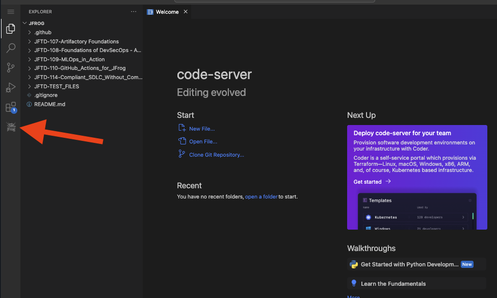
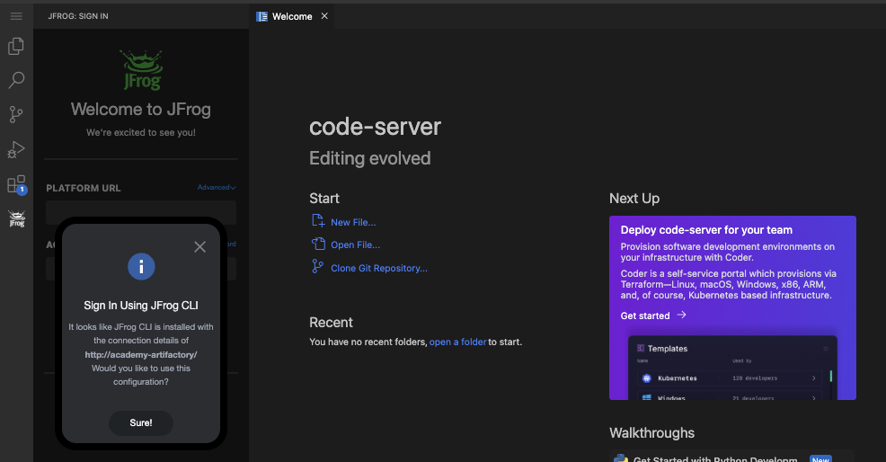
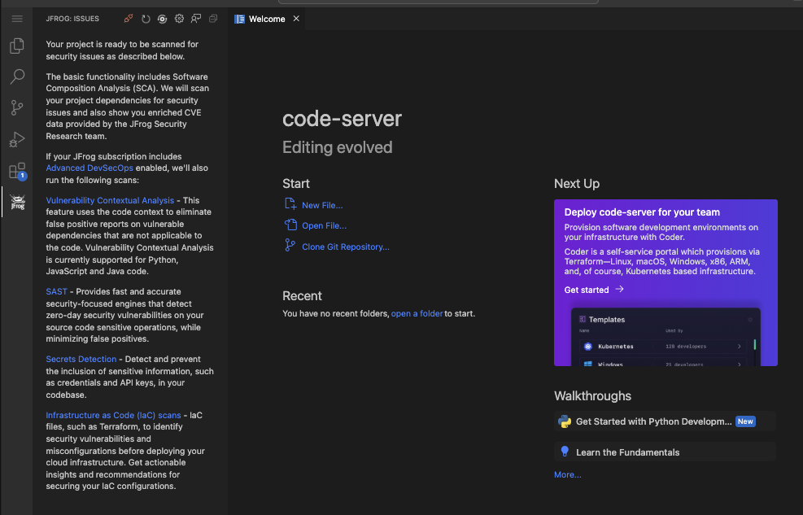
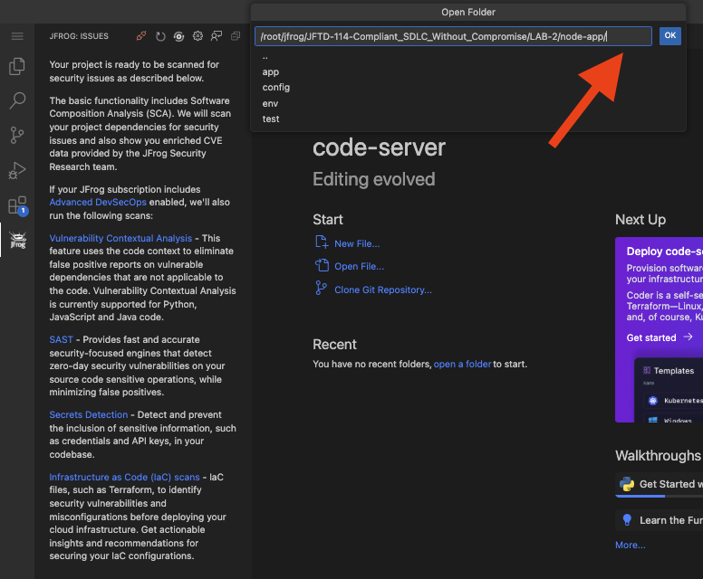
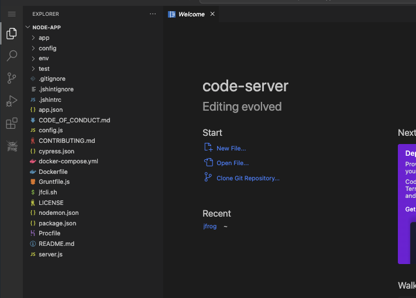
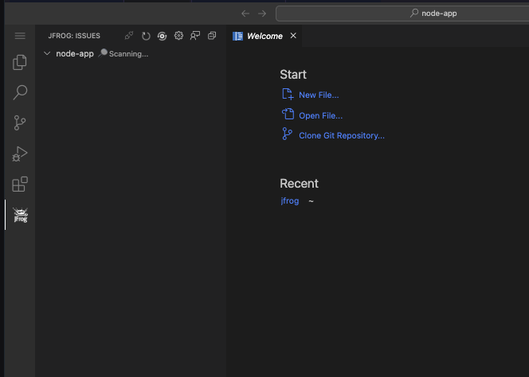
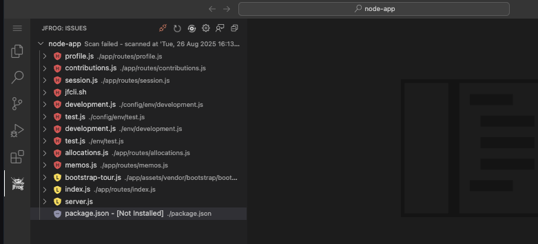
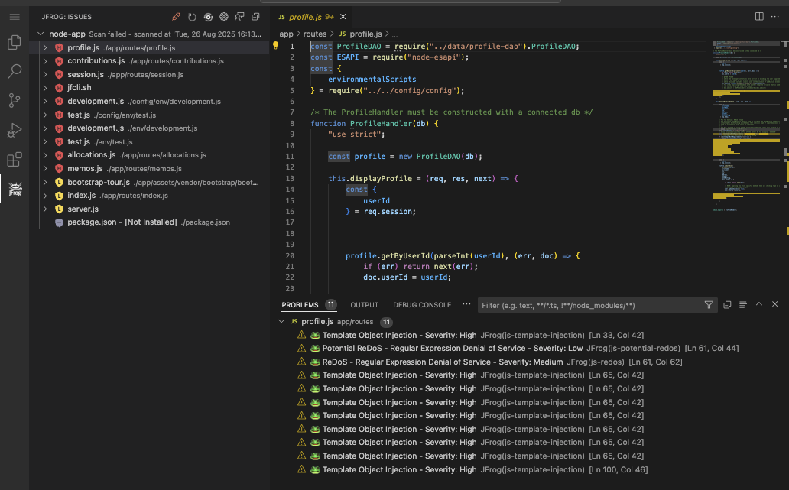

# Lab 2: Identify Secrets & Malicious Indicators
This lab will walk you through the process of using the JFrog extension for Visual Studio Code to scan NodeJS project, analyze the results, and understand the security issues present in your open-source dependencies.

## Prerequisites
Before you begin, make sure you have the following:
- VS Code: Installed on the lab machine.
- JFrog Platform Account: You'll need the URL and login credentials for your JFrog environment.
    - url: http://academy-artifactory/
    - user: admin
    - password: Admin1234!
- A Project to Scan: Sample NodeJS project is ready to be scanned

## Setup & Instructions
- Open the JFrog Extension: In the Visual Studio Code activity bar on the left, click on the JFrog frog icon to open the extension.
  

- Connect to Your JFrog Platform: A pop-up will appear asking you to sign in using JFrog CLI. Click "Sure!" and follow the prompts to authenticate with your JFrog Platform URL and credentials.
  

- Open the Project Folder: Once authenticated, you need to open the lab's project folder. Click on "Open Folder" and navigate to the directory /root/jfrog/JFTD-114-Compliant_SDLC_Without_Compromise/LAB-2/node-app.
  

- Explore the Project: You can now see the file structure of the node-app project in the Explorer view. This is a simple Node.js application with several dependencies.
  

- Initiate a Scan: The JFrog extension will automatically start scanning your project for security vulnerabilities. You can see the "Scanning..." status in the JFrog extension view.
  

- View Scan Results: Once the scan is complete, the JFrog extension will display a list of all the security issues found in your project's dependencies.
  

- Analyze a Vulnerability: Click on one of the vulnerable files, such as profile.js, to view the details of the security issue. The "PROBLEMS" tab at the bottom will show you information about the vulnerability, including its severity and the exact line of code where it is located.

  
  

## Conclusion
Congratulations! You have successfully scanned a Node.js application for security vulnerabilities using the JFrog extension for Visual Studio Code.
 
In this lab, you learned how integrating security scanning directly into your IDE can help you shift security left, enabling you to find and fix issues earlier in the development lifecycle. This proactive approach to security helps reduce risk and ensures that you are building more secure applications.

## References
- Source code forked from https://github.com/OWASP/NodeGoat
- JFrog IDE: https://jfrog.com/help/r/jfrog-security-user-guide/shift-left-on-security/ides 
- JFrog CLI: https://docs.jfrog-applications.jfrog.io/jfrog-applications/jfrog-cli/binaries-management-with-jfrog-artifactory/package-managers-integration#building-npm-packages-using-the-npm-client
-  