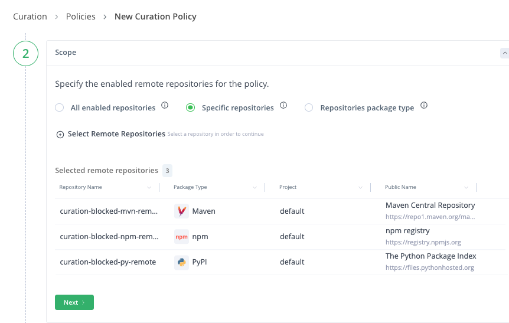
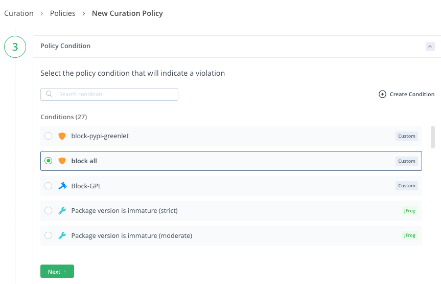
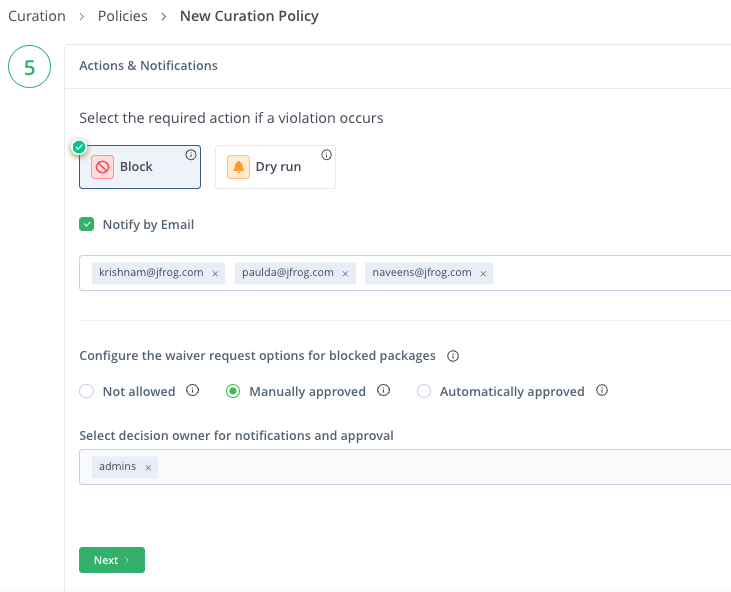

# Java app

## Prestep
- Create remote repo 'curation-blocked-mvn-remote'


## Curation Policy
- login to Artifactory
- go to tab 'Platform'
- left navigation Curation >> Policies 
- Create new policy 
    - policy name: curation-blocked-remote
    - scope: specific repositories
        - select remote repo: curation-blocked-mvn-remote
    - Policy Condition: Block all
    - Waiver: BLOCK THIS
    - Actions & Notification: BLOCK
    - Configure the waiver request options for clock packages: Manually approved
        - select decision owner for notification and approval: admin

### Execution using JFrog CLI
```
jf mvn --repo-resolve=${RT_REPO_REMOTE} 

jf ca --format=table --threads=100
```

### Screen flow

<br/>

<br/>

<br/>

<br/>

<br/>